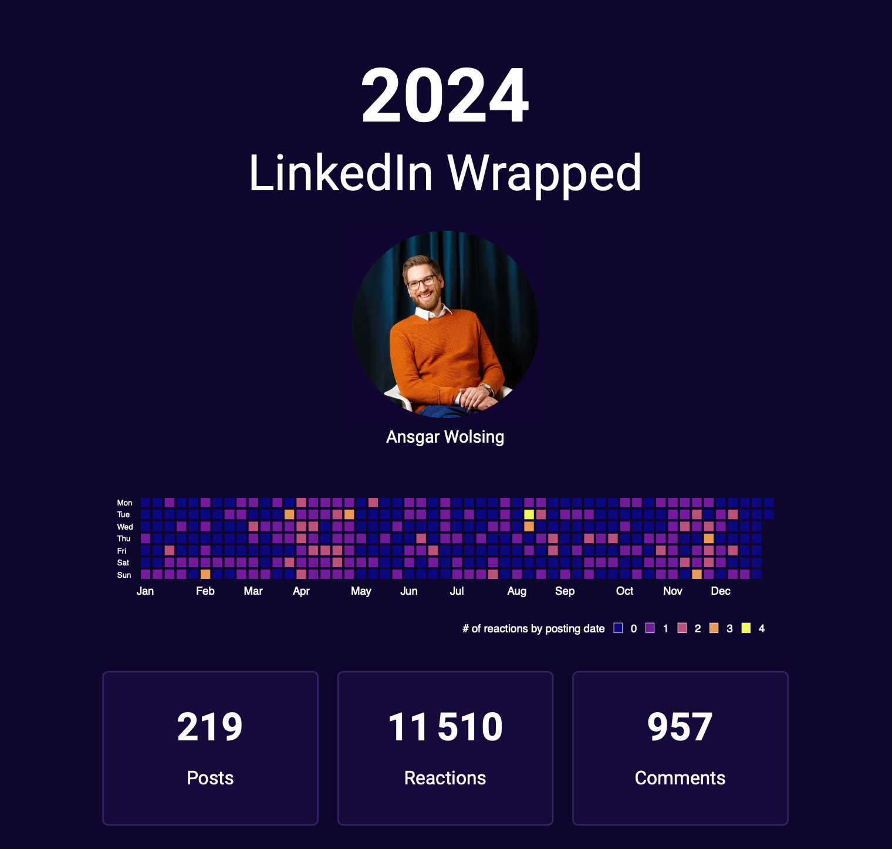

# Create Your Own LinkedIn Wrapped

You want to create your own LinkedIn <s>Un</s>Wrapped, but don't want to share your 
e-mail address with yet another AI service?

Here's how:

1. Clone this repository.
2. Request a full copy of your LinkedIn data via https://www.linkedin.com/mypreferences/d/download-my-data. Note that it can take up to 48 hours until the archive is ready for export.
3. Once the archive (zip file) is available, download it and store it into the [data](bydata/linkedin-wrapped/tree/main/data) folder. You don't need to extract the archive.
4. Render the Quarto document linkedin-wrapped.qmd in the [docs](bydata/linkedin-wrapped/tree/main/docs) folder. The YAML header contains two parameters that control whether you scrape the reactions data for your posts from LinkedIn from the Quarto document (`scrape_reactions: true`) and for which year you want to create the report, e.g. `year: 2024`.

[{width=500}](https://github.com/bydata/linkedin-wrapped/blob/main/docs/linkedin-wrapped.pdf)
